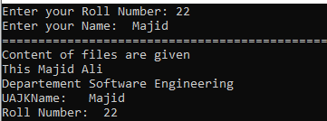
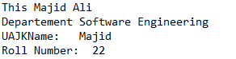
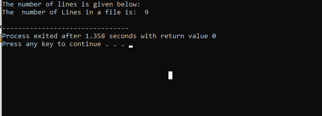
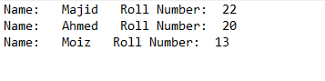
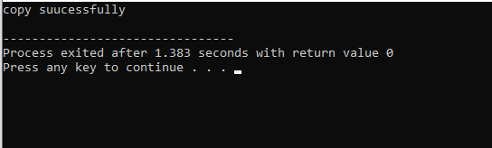

## ============================================= lab 01 ==========================================
# 💻 C++ Console Application - Lab Project

This project includes **6 different C++ programs** that cover basic concepts like user input, conditional statements, arithmetic operations, and functions. Each task is represented with an image from the output for better understanding.

---

## 📚 Tasks Overview

---

### ✅ **Task 01: Student Information System**
The user enters their **name** and **roll number**, and the program displays both.

📸 Output Image:  

  

---

### ✅ **Task 02: Rectangle Area & Perimeter Calculator**
The customer enters **width** and **length** of a rectangle.  
The program calculates and displays:
- **Area = width × length**
- **Perimeter = 2 × (width + length)**

📸 Output Image:  

  

---

### ✅ **Task 03: Voter Eligibility Checker**
This program checks whether a person is **eligible to vote** or not.  
If the entered age is **greater than or equal to 18**, the person is eligible.

📸 If Eligible:  

  

📸 If Not Eligible:  

  

---

### ✅ **Task 04: Celsius to Fahrenheit Converter**
This program takes a temperature in **Celsius** and converts it to **Fahrenheit** using the formula:  
**F = (C × 9/5) + 32**

📸 Output Image:  

  

---

### ✅ **Task 05: Simple Calculator**
The program performs basic operations:

- ➕ **Addition**

  

    
  

- ➖ **Subtraction**

  

    
  

- ➗ **Division**

  

    
  

- ✖️ **Multiplication**

  

    
  

---

### ✅ **Task 06: Product Billing System**
This task accepts:
- **Product Price**
- **Product Quantity**

The program calculates the **total cost** and includes **validation**:
- If input is correct, shows result.
- If **price is negative**, displays a validation error.

📸 Correct Input:  

  

📸 Validation Error:  

  

---

## 🛠️ Tools Used
- Language: **C++**
- Compiler: **G++ / Dev-C++ / Code::Blocks**
- Platform: **Console-based Application**

---

---

## 📎 Note
This lab project is designed for **beginners** in C++ and covers the basics of:
- I/O
- Arithmetic operations
- Conditionals
- Data validation
- Functions

---

## =================================================== Lab 02 ============================================
## Task 1:  Default Constructor — Employee 
  ##       Management System
  Create a class named Employee for a basic employee management system.  
The class should have the following private data members: 
❑ id (int) 
❑ name (string) 
❑ salary (float) 
Implement a default constructor that initializes: 
❑ id = 0 
❑ name = "Not Assigned“ 
❑ salary = 0.0 
Also include: 
❑ A displayDetails() method that shows employee details. 
❑ A main() function that creates an object using the default constructor and displays 
its information. 

## 📸 OUT PUT

  

---

## Task 2: Parameterized Constructor — Bank 
##          Account Initialization
Create a class named BankAccount that manages account information. 
It should have the following private data members: 
❑ accountNumber (string) 
❑ accountHolder (string) 
❑ balance (double) 
Implement a parameterized constructor to initialize all three values 
when a new account is created: 
❑ id = 0 
❑ name = "Not Assigned“ 
❑ salary = 0.0 
Also include: 
❑ A method showAccountDetails() to display the account information.. 
❑ In main(), create an object of BankAccount using user-defined values and display 
the account details. 
## 📸 OUT PUT

  

---
## Constructor Overloading
Create a class named Rectangle with the following private data members: 
❑ length (float)  
❑ width (float)  
Overload the constructor as follows: 
❑ A default constructor that initializes both length and width to 1.0. 
❑ A parameterized constructor that takes two float values to initialize length and 
width. 
❑ A single-parameter constructor that sets both length and width to the same value 
(creating a square). 
Also include: 
❑ A method area() to return the area of the rectangle and a display() method.  
❑ In main(), create three objects using all constructor versions and display their 
dimensions and area. 

## 📸 OUT PUT

  

---

## Task 4: Destructor
Create a class called Locker that represents a bank locker. 
◼ The constructor should print: 
"Locker allocated to customer.“ 
◼ The destructor should print: 
"Locker returned by customer.“ 
Inside your main() function: 
❑ Create one locker object inside a block { } to observe automatic 
destructor call. 
❑ Create another locker using new and release it using delete. 

## 📸 OUT PUT

  

---
## ========================================================== Lab 03 =================================================

## Task 1: Copy Constructor –Shallow Copy
Create a BankAccount class using a pointer to store the 
balance. 
◼ Dynamically allocate memory in the constructor. 
◼ Use the default copy constructor by copying an object. 
◼ Modify the copied object. 
◼ Display both balances to show the side effects of shared memory. 
◼ Observe how the destructor is called twice on the same memory 
location, causing a runtime error or undefined behavior (if not
handled safely). 

## 📸 OUT PUT

  

---

## Task 2: Copy Constructor –Deep Copy
Update the BankAccount class (created in task 1) to 
include a deep copy constructor. 
◼ Ensure each object gets its own separate copy of the balance. 
◼ After copying and modifying one object, show that the original 
remains unchanged. 
◼ Use a destructor to safely free memory without double deletion. 

## 📸 OUT PUT

  

---

## Task 3: Single Inheritance

Create a base class Person with the following properties: 
◼ string name, int age. 
Then, create a derived class Student that inherits from Person and adds the
following property: 
◼ int rollNo. 
## Implement the following functionality:
◼ A method setPerson(string, int) in the Person class to initialize name and
age. 
◼ A method setStudent(string, int, int) in the Student class to set the values
of name, age, and rollNo. 
◼ Important: While setting values in setStudent, you must call the setPerson
method from the Person class to set the name and age properties. 
◼ A method showPerson() in the Person class to display the name and age. 
◼ A method showStudent() in the Student class to display the name, age,
and rollNo. 

## 📸 OUT PUT

  

---

## Task 4: Constructor in Inheritance
Create a base class Shape with a constructor that prints "Shape 
constructor called" when it is invoked. 
Then, create a derived class Rectangle that inherits from Shape and 
has its own constructor. The constructor of Rectangle should print 
"Rectangle constructor called" when invoked. 
## Demonstrate the following:
◼ When an object of Rectangle is created, observe the order in which 
the constructors are called. 
◼ Implement constructor calls in main() to see that the base class 
constructor is called before the derived class constructor. 

## 📸 OUT PUT

  

---

## ========================================================== Lab 04 ==================================================

## Task: 01 – Single Inheritance
You are building a student information system. Create a 
Person class and a Student class that inherits from it. 
◼ Classes & Requirements: 
❑ Person: 
Attributes: name, age 
 Functions: display_person_info() 
❑ Student (inherits Person): 
Additional Attribute: student_id 
Additional Function: display_student_info() 
◼ Tasks for Students: 
❑ Define both classes using single inheritance. 
❑ Accept input from the user for all fields. 
❑ Display complete student information using both functions. 

## 📸 OUT PUT

  

---

## Task: 02 – Multilevel Inheritance
You are designing a payroll system. 
◼ Classes & Requirements: 
❑ Person: 
Attributes: name, age 
 Function: display_person()  
❑ Employee (inherits Person): 
Additional Attribute: employee_id 
Additional Function: display_employee() 
❑ Manager (inherits Employee): 
Additional Attribute: department 
Function: display_manager() 
◼ Tasks for Students: 
❑ Implement multilevel inheritance. 
❑ Accept input and display complete info using all display 
functions. 

  

---

## Task: 03 – Hierarchical Inheritance

In an organization, Employee is a base class. Developer and 
Designer inherit from it. 
◼ Classes & Requirements: 
❑ Employee: 
Attributes: name, salary 
 Function: display_employee()  
❑ Developer (inherits Employee): 
Additional Attribute: programming_language 
Additional Function: display_developer() 
❑ Designer (inherits Employee): 
Additional Attribute: design_tool 
Function: display_designer() 
◼ Tasks for Students: 
❑ Implement hierarchical inheritance. 
❑ Create objects of both derived classes and display all information. 

  

---

## Task: 04 – Multiple Inheritance

Build a device that behaves as both a Printer and a Scanner. 
◼ Classes & Requirements: 
❑ Printer: 
 Function: print_document ()  
❑ Scanner 
Function: scan_document() 
❑ Photocopier (inherits from Printer and Scanner): 
Function: photocopy() (calls both above functions) 
Tasks for Students: 
❑ Implement multiple inheritance. 
❑ Create an object of Photocopier and call all functions. 

  

---
======================================================== Lab 05 ===================================

# 🧩 Object-Oriented Concepts — Aggregation & Composition

---

### ✅ **Task 01: Aggregation**
This task demonstrates **Aggregation**, which represents a **“has-a” relationship** between classes.  
- A class contains the reference of another class but both can exist **independently**.  
- Example: A *Department* may have *Students*, but deleting a department does not delete the student.  

📸 Output Image:  

  

---

### ✅ **Task 02: Composition**
This task demonstrates **Composition**, which also represents a **“has-a” relationship**, but it is **stronger** than aggregation.  
- If the container class is destroyed, the contained objects are also destroyed.  
- Example: A *House* contains *Rooms*. If the house is destroyed, the rooms no longer exist.  

📸 Output Image:  

  

---

=========================================================== Lab 06 & 07 ====================================

# 🔄 Function Overloading, Overriding & Operator Overloading

---

### ✅ **Task 01: Function Overloading**
This program shows **Function Overloading**, where multiple functions share the same name but differ in:  
- Number of parameters  
- Types of parameters  

📸 Output Image:  

  

---

### ✅ **Task 02: Function Overriding**
This program demonstrates **Function Overriding** using **Inheritance**.  
- A derived class provides a new definition for a base class function.  
- Useful for **runtime polymorphism**.  

📸 Output Image:  

  

---

### ✅ **Task 03: Shape Finder (Override & Declaration)**
This task uses **Function Overriding** to calculate shapes:  
- Rectangle  
- Circle  

📸 Output Image:  

  

---

### ✅ **Task 04: Operator Overloading for Complex Numbers**
This task implements **Operator Overloading**:  
- Overloads operators to perform addition, subtraction, etc. on **complex numbers**.  
- Shows how user-defined types can behave like built-in types.  

📸 Output Image:  

  

---

============================== Lab 08 =============================================

# ⚙️ Advanced Concepts — Virtual & Friend Functions

---

### ✅ **Task 01: Pure Virtual Function**
This program demonstrates **Abstract Classes** using a **Pure Virtual Function**.  
- Ensures derived classes implement their own version.  
- Provides **runtime polymorphism**.  

📸 Output Image:  

  

---

### ✅ **Task 02: Friend Function**
This task shows how a **Friend Function** can access private data of a class.  
- Breaks encapsulation intentionally for flexibility.  
- Useful for operator overloading and utility functions.  

📸 Output Image:  

  

---

===================================== Lab 09 =================================================

# 📌 Static Members in C++

---

### ✅ **Task 01: Static Member Function**
This program demonstrates **Static Members**:  
- A **static variable** is shared among all objects of a class.  
- A **static function** can be called without creating an object.  

📸 Output Image:  

  

---

===================================== Lab 10 ===============================================

# 📂 File Handling in C++

---

### ✅ **Task 01: Read, Write, Delete Files**
Demonstrates file operations like:  
- Writing data  
- Reading data  
- Deleting file contents  

📸 Output Image:  

  

📸 File Image:

  

---

### ✅ **Task 02: Count Number of Lines**
This program counts the **number of lines** in a text file.  

📸 Output Image:  

  

---

### ✅ **Task 03: Add Student Details**
Appends student details into a text file for **record-keeping**.  

📸 Output Image:  

  

📸 File Image

  

---

### ✅ **Task 04: Copy File Content**
Copies the content from one file to another.  

📸 Output Image:  

  

---

============================================================= Lab 11 ======================================

# 📝 File Pointers in C++

---

### ✅ **Task 01: tellp()**
Shows how to get the current **put pointer** position in a file.  

📸 Output Image:  

  

---

### ✅ **Task 02: tellg()**
Shows how to get the current **get pointer** position in a file.  

📸 Output Image:  

  

---

### ✅ **Task 03: seekp()**
Moves the **put pointer** to a specified location in a file.  

📸 Output Image:  

  

---

### ✅ **Task 04: seekg()**
Moves the **get pointer** to a specified location in a file.  

📸 Output Image:  

  

 

---

========================================================= Lab 12 ==============================================

# ⚡ Exception Handling in C++

---

### ✅ **Task 01: Exception Handling in Calculator**
Implements exception handling to prevent invalid operations in a **Calculator Program**.  

📸 Output Image:  

  

---

### ✅ **Task 02: Exception Handling in Division**
Handles division operations safely by checking for:  
- Division by zero  
- Invalid input  

📸 Output Image:  

  

---

================================================== Lab 13 ==================================================

# 🧮 Templates in C++

---

### ✅ **Task 01: Calculator using Templates**
This task uses **C++ Templates** to create a calculator that works with multiple data types (**int, float, double**).  

📸 Output Image:  

  

---

## 👨‍💻 Author

**Majid Ali**